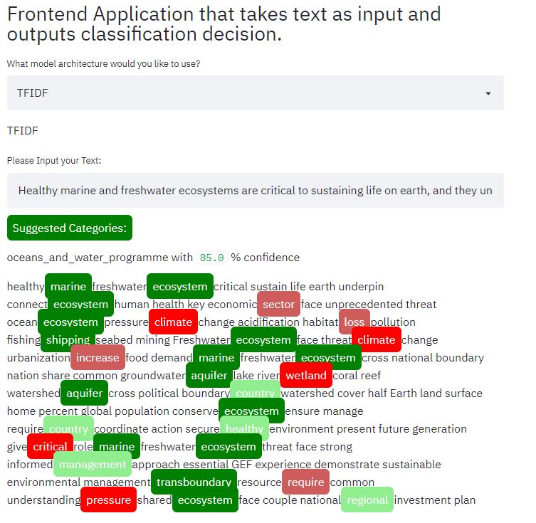
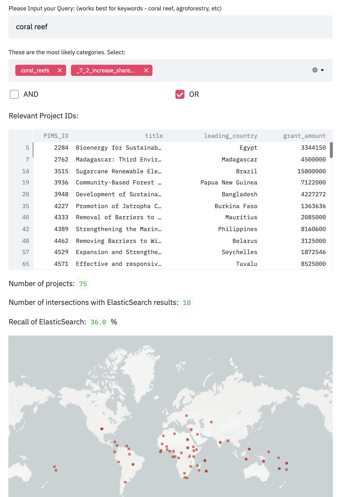
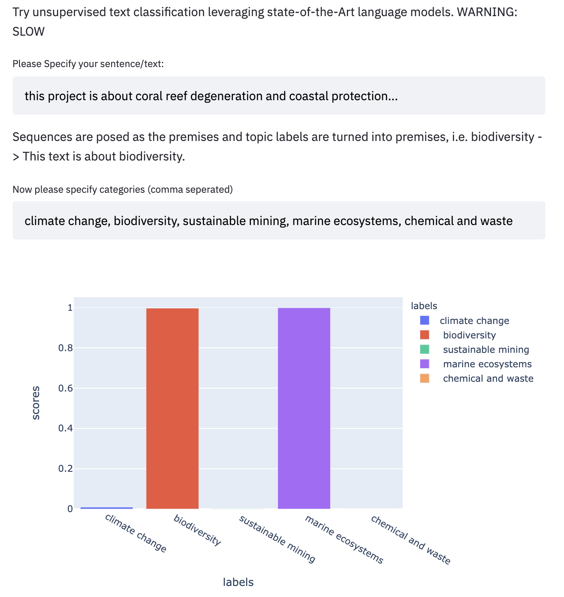

# Nature Climate and Energy Taxonomy Classification & Portfolio Analysis Experiments
This Repository contains the data and code to set up the taxonomy classification excercise. It is well documented and structured in a way that it can be simply deployed by following the instructions below.
Apart of the taxonomy classification excersise, this repository also features several experiments:
* Neural Question Answering
* Neural and Fuzzy Structured Search - as an improvement over ElasticSearch
* Zero-Shot Text Classification for unsupervised categorisation.
All these items are further explained and introduced in more detail below.

Finally, the repository also contains a web application written in Python using the streamlit library. It allows to test all models and tools and make them acessible for each team member.

**Each folder has its own documentation to specify what the code inside does. The code is commented.**

Contents
========

 * [Why?](#Why?)
 * [Installation](#Installation-Setup)
 * [Usage](#Usage)
 * [Data](#Data)
 * [Taxonomy Classification](#Taxonomy-Classification-Excercise)
 * [Neural and Fuzzy Structured Search](#Neural-Search)
 * [Neural Question Answering](#neural-qa)
 * [Zero Shot Classification](#zero-shot)
 * [Web Application](#streamlit)
 * [Next Steps](#next)
 * [Notes](#notes)

## Why
Having a large portfolio of projects it is crucial have a way to extract meaningful, reliable and agreggated information. We may very well know how many projects we run in a specific country or region but what if we need understand what our portfolio is on a specific topic such as "climate change mitiigation", "green chemistry" or zooming further in "beekeeping".

Initially, we tried to leverage unsupervised learning algorithms such as topic modelling and clustering to find the thematic areas of our portfolio and query it accordingly. This, however, did not bring the desired level of reliability and accuracy. In order to overcome this problem we worked on establishing a comprehensive, in-depth taxonomy that allows us to cover the portfolio in granuality. By consulting each thematic team we manually labelled our portfolio with hundreds of categories to cover as much information as possible.

The Machine Learning part comes at a later step now. We are using the labeled portfolio to train models to understand the linkages between our projects and the categories. Why is this helpful?
1. Labeling is a very time and cost intesive work. Having trained models we can automatise the labeling for future projects and gradually improve the model performance over time.
2. We may infer projects outside our portfolio to our taxonomy and see how it would be positioned.
3. Within this project we can also improve the querying of our portfolio employing powerful pre-trained neural language models to find the exact information we need.
4. Spill-over effects: By setting up this projects we have to build data pipelines, process portfolio data and connect it with the system and team. This will open many opportunities for other data-driven projects using this pioneer work to build on. 
5. Through this project our team and UNDP as a whole may advance further to truly digital and innovative work approaches. s

---
## Installation
Please use Python <= 3.7 to ensure working protocols.

Clone the repo from github or from Azure to your local machine:

Example command:
```
git clone https://github.com/SDG-AI-Lab/NCE_Document_Classification.git
```
To only run the web application and use the trained models with processed data install following dependencies in a virtual environment:
```
python3.7 -m venv venv
source venv/bin/activate
pip install --upgrade pip setuptools
pip install -r requirements.txt
```
On the first run, the app will download several GBs ob pre-trained transformer models and will store them on your local system. 
To start the application, navigate to the streamlit folder and simply run:
```
streamlit run main.py
```
To run the whole repo - for instance if you wish to re-train all the models and process the data by yourself - more dependencies are needed and creating multiple virtual environments for the individual steps is recommended. The easiest way is to have a look at the respective libraries that are used for each code snippet and install them on a virtual machine with Python <= 3.7. 

---
## Usage
For easy and smooth re running of all the code and experiments, notebooks have been added and set up properly.

### 1. Get and process the data
To start you can run the notebooks inside the **notebooks_data_processing** folder:
1. make_dataset: Loads all data sources, pre-processes the data and merges the data to one file.
2. data_cleaning: Applies a set of cleaning functions to process and prepare the data for analysis.
3. make_data_encoding_labels: Takes care of the labels and encodes them to a machine readable, machine-learning ready format.
4. make_final_dataset: Adds some specific steps of cleaning and processing that came up during model development and outputs final datasets. 

### 2. Train and save classification models
This folder contains notebooks that run specific model trainings for each category. To train and store the models used in the application you may run one of the two notebooks:
1. classification_tfidf_only
2. classification_tfidf_lsa
The folder contextual_embeddings contains training scripts for more sophisticated model that proved to be underperforming. 

### 3. Run and test models and other experiments: 
You may either run the web application for testing and running all models or you may use the notebooks providing in the respective folders:
1. sentence_transformers for neural search
2. zero_shot_classifiaction for unsupervised categorisation. 
3. nerual_question_answering for neural QA.

**It is recommended to follow the installation guideline above and run the web application on your local system.**

---

## Data
The data used for this project comes from two sources:
1. API from PIMS+ to pull the portfolio data.
2. an excel sheet that contains the latest version of the taxonomy.

In order to produce proper training data both dataset were merged on PIMS ID level. Multiple steps for data processing were applied to ensure highest possible quality.
For detailed instructions and explanations please consult the respective python codes with comments. 

---

## Taxonomy Classification
Classify documents/text to over 300 categories of the newly introduced taxonomy and obtain detailed "black-box-algorithm" explanation of your prediction.
As a supervised machine learning problem following steps have been implemented: 

1. Data Processing
2. Data Exploration
3. Feature Engineering
4. Model Training 
5. Model Evaluation
6. Deployment (Web Application)

The great challenge of this project was the data quality and size. It was difficult to establish a dataset with trustful data. The data size is very small for a machine learning project and labels are heavily unbalanced. Hence we only trained models on datapoints that appeared more than 20 times. In other words, **not each category is predictable**. This will hopefully be solved over time with growing training data. 

To tackle these issues several experiments were run:
* Using pre-trained language models (transformers) as well as other contextual embedding models to bootstrap the performance. This has proven to be not very effective. First our domain is to specify to benefit largely from pre-trained models and second - even if performance was increased - the cost and time for training expensive neural nets did not outweigh benefits of simpler models.
* Features were manually tuned and weighted - this worked quite well but it is difficult to make final decisions on feature weights. Hence the final trained models were able to choose their features freely. 
* Since we must classify hundreds of labels, the problem was turned into a multiple binary classification problem. Meaning that one classifier per category was trained. Alternatively, we may train a multi-label classification problem, however, the number of labels is too large and the size of training data too small for promising results. It was extensively tested, and results were disappointing. 

The final model architecture is relatively simple but has outperformed all other combination of feature engineering and predictive model architectures. Features are build using **tf-idf embeddings** and models are fitted with **logistic regressions**. Note that the labels are heavily unbalanced which has been carefully resembled in the set-up of the logistic classifier. 
This architecture was used also due to its interpretability. It is fairly easy to understand why a prediction was made. Special attention has been put on the explainability and a customised visual output has been coded to showcase what words and sentences have the strongest impact on a decision. 

### Specifically following algorithms were tested:
* AdaBoost
* Logistic Regression 
* Stochastic Gradient Descent
* Random Forest
* K Nearest Neighbor
* Gaussian Naive Bayes
* Decsision Tree


### Following embeddings were used:
* Roberta 
* Glove
* Word2Vec
* Doc2Vec
* Tf-idf
* Bert
* Distilbert
* Longformer 

Note that the training data usually has far more than 512 characters. Transformers are not built to process such long texts. Thus sliding-windows has been employed to overcome those issues. 

### Text-Classification
Deploys trained ML Text Classification models and allows for user feedback to iterate and improve performance over time. 

Input any text and choose from up to 153 categories for prediction. Obtain results and manually correct predictions. For the sandbox, the original text and feedback is stored in a [Firebase](https://firebase.google.com/?hl=de) DataBase and can be used for further model training and tuning.


Detailed explanation of important features that algorithm uses for decision:



---
## Neural and Fuzzy Structured Search
Try out contextual structured search (with AND/OR) and compare to Elastic Search results. Here you can choose between fuzzy string matching and neural sentence transformers for contextual embeddings that understand the context of your queries.



---

## Neural Question Answering
Question answering (QA) is a computer science discipline within the fields of information retrieval and natural language processing (NLP), which is concerned with building systems that automatically answer questions posed by humans in a natural language.
A question answering implementation, usually a computer program, may construct its answers by querying a structured database of knowledge or information, usually a knowledge base. More commonly, question answering systems can pull answers from an unstructured collection of natural language documents.
[Source](https://en.wikipedia.org/wiki/Question_answering).


Try this application to ask open questions to the UNDP project documents using a Neural QA pipeline powered by sentence transformers to build corpus embeddings and ranking of paragraphs. For retrieval a pre-trained transformer model for extractive QA is applied. The results are highlighted in html.

[](#features)

### Upcoming and Possible Ideas
* Add new data sources. 
* FAISS Indexing (50% Done)
* Telegram Chatbot Implementation.
* Refined Ranking.
* Refined Extractive QA

---


## Zero Shot Classification
Try an implementation of hugginface's Zero-Shot classification model. This allows to use powerful language models to classify text to new categorie without training a model. 


---

## Web Application
To propery communicate the findings and result to the team, a web application has been programmed and hosted with the native python library streamlit. Please see the installation instructions to run it on your local system. Due to privacy concerns the app is not publicly hosted currently and has to be run on your local system. 

---

## Next Steps
Following steps are recommended:

1. Connenct the code to an API that allows to pull the final taxonomy.
2. Build a data pipeline that pulls both taxonomy and portfolio data from the API and merges them accordingly. Automate and Time. 
3. Re-train models.
4. Deploy trained models on PIMS+ to allow for automate tagging suggestions. 
5. Build feedback loop and re-train models over time until performance is satisfactory. 
6. Continue improving model architecture.
---

## Notes

Experiments are continuously pushed in notebooks to the repo.
Due to computational reasons, deep learning approaches are trained and evaluated on GPU powered notebooks. See specifically: 
* https://cloud.google.com/ai-platform

And for older experiments:
* https://console.paperspace.com/tesl8wodi/notebook/pr1zmah40

---