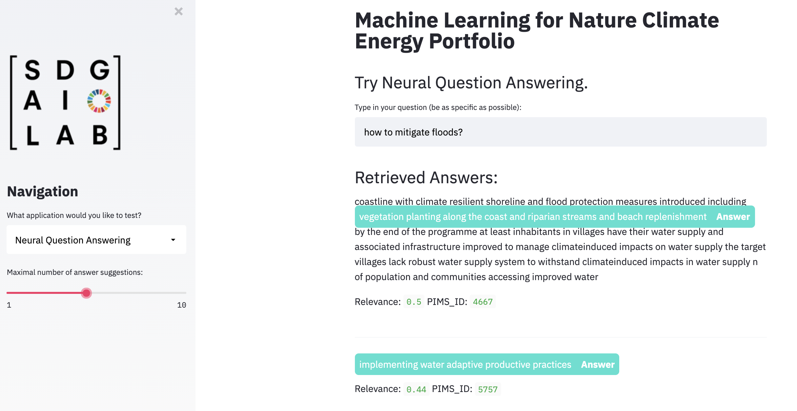

# Setup

Please use Python <= 3.7 to ensure working pickle protocol.

Clone the repo to your local machine:
```
https://github.com/SDG-AI-Lab/NCE_Document_Classification.git
```
To only run the web application install the dependencies in a virtual environment:
```
python3.7 -m venv venv
source venv/bin/activate
pip install --upgrade pip setuptools
pip install -r requirements.txt
```
On the first run, the app will download several transformer models and will store them on your local system. 
To start the application, navigate to the streamlit folder and simply run:
```
streamlit run main.py
```
To run the whole repo, more dependencies are needed and creating multiple virtual environments for the individual steps is recommended. 

# NCE Document Classification
Working Repo for building a set of models to automate the classification of project log-frames to a comprehensive taxonomy.

## Classification Experiments
Classify documents/text to over 300 categories of the newly introduced taxonomy and obtain detailed "black-box-algorithm" explanation of your prediction.

### Text-Classification-Feedback-Loop
Deploys trained ML Text Classification models and allows for user feedback to iterate and improve performance over time. 

Input any text and choose from up to 153 categories for prediction. Obtain results and manually correct predictions. The original text and feedback is stored in a [Firebase](https://firebase.google.com/?hl=de) DataBase and can be used for further model training and tuning.


### Detailed explanation of important features that algorithm uses for decision


Experiments are continuously pushed in notebooks to the repo.
Due to computational reasons, deep learning approaches are trained and evaluated on GPU powered notebooks. See specifically: 
* https://cloud.google.com/ai-platform

And for older experiments:
* https://console.paperspace.com/tesl8wodi/notebook/pr1zmah40

## Structured Search VS. ElasticSearch
Try out contextual structured search (with AND/OR) and compare to Elastic Search results. Here you can choose between fuzzy string matching and neural sentence transformers for contextual embeddings that understand the context of your queries.


## Neural Question Answering:
Basic Neural QA pipeline that uses whoosh for document similarity and a pre-trained transformer model for extractive QA. Highlighted in html. 



## Zero Shot Classification
Try an implementation of hugginface's Zero-Shot classification model:


## Information Extraction 

This work streams aims to turn the unstructured data from the log frames to structured data and allows to explore and aggregate the textual data.
